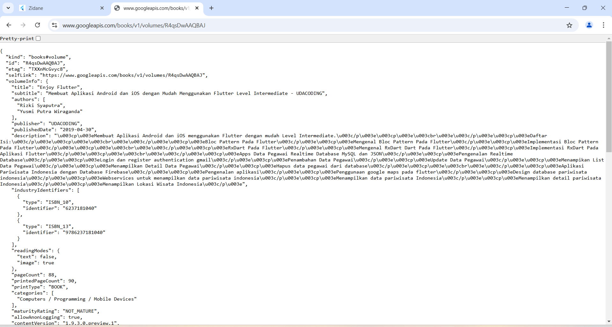
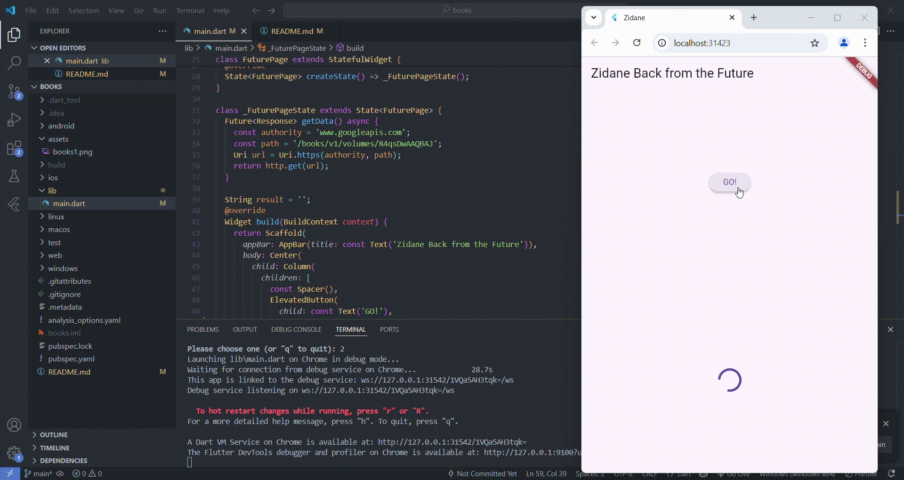
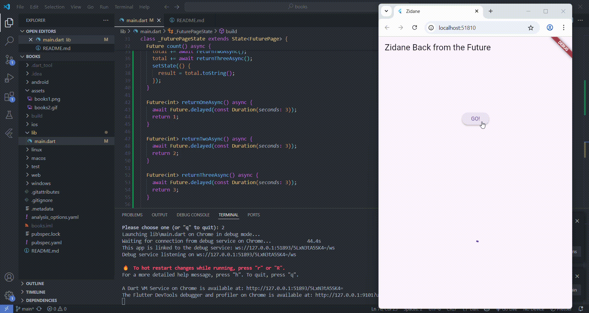
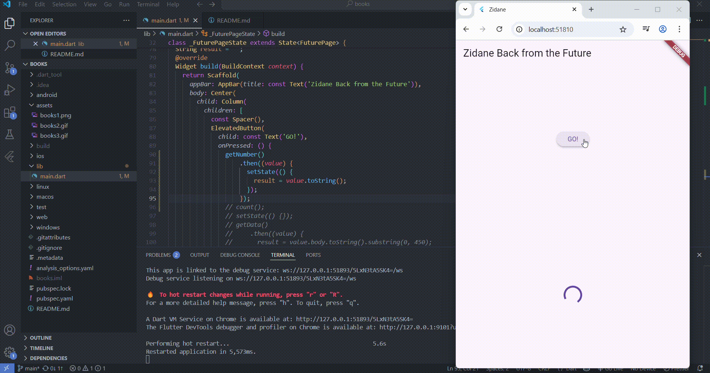
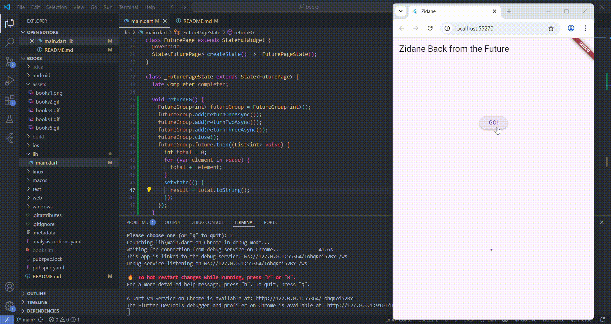

# Laporan Praktikum

A Flutter project Books.

## Praktikum 1
### Soal 2


### Soal 3


1. Penggunaan substring(0, 450)
substring(0, 450): Mengambil 450 karakter, mulai karakter 0 sampai 450 dari hasil response.
Berguna jika response terlalu panjang, sehingga hanya sebagian kecil ditampilkan.

2. catchError(_)
Menangani Kesalahan (Error Handling) jika getData() gagal (misalnya koneksi terputus atau server error), fungsi catchError() akan menangkap error tersebut.
Error ditangani dengan menampilkan pesan "An Error Occurred" agar pengguna tahu ada masalah. 
setState(() {}); dipanggil agar UI diperbarui dengan pesan error.

## Praktikum 2
### Soal 4
* Langkah 1: Menambahkan Tiga Method Asynchronous
```dart
Future<int> returnOneAsync() async {
    await Future.delayed(const Duration(seconds: 3));
    return 1;
  }

  Future<int> returnTwoAsync() async {
    await Future.delayed(const Duration(seconds: 3));
    return 2;
  }

  Future<int> returnThreeAsync() async {
    await Future.delayed(const Duration(seconds: 3));
    return 3;
  }
```

Penjelasan:
1. Future<int>: Method ini mengembalikan nilai bertipe Future<int>, yang berarti nilainya tidak langsung tersedia, melainkan akan didapatkan setelah proses asinkron selesai.
2. await Future.delayed(Duration(seconds: 3)): 
    - Simulasi proses yang membutuhkan waktu 3 detik (misalnya pemanggilan API atau proses berat lainnya).
    - await memastikan eksekusi menunggu selama 3 detik sebelum melanjutkan ke baris berikutnya.
3. Setelah menunggu, masing-masing method mengembalikan angka tertentu (1, 2, atau 3).

* Langkah 2: Menambahkan Method count()
```dart
Future count() async {
    int total = 0;
    total = await returnOneAsync();
    total += await returnTwoAsync();
    total += await returnThreeAsync();
    setState(() {
      result = total.toString();
    });
  }
```

Penjelasan:
1. Future count() async {} -> Method ini bertipe Future karena menggunakan await untuk menangani operasi asinkron.
2. int total = 0; -> Variabel untuk menyimpan hasil perhitungan.
3. Menjalankan tiga method async secara berurutan:
    - total = await returnOneAsync(); -> Tunggu 3 detik, lalu total = 1.
    - total += await returnTwoAsync(); -> Tunggu 3 detik lagi, lalu total = 1 + 2 = 3.
    - total += await returnThreeAsync(); -> Tunggu 3 detik lagi, lalu total = 3 + 3 = 6.
    - Total waktu eksekusi = 3 + 3 + 3 = 9 detik (karena dijalankan secara berurutan).
4. setState(() { result = total.toString(); }); -> Memperbarui UI setelah semua operasi selesai (9 detik), nilai total dikonversi ke String dan ditampilkan di UI.


## Praktikum 3
### Soal 5
```dart
late Completer completer;

  Future getNumber() {
    completer = Completer<int>();
    calculate();
    return completer.future;
  }

  Future calculate() async {
    await Future.delayed(const Duration(seconds: 5));
    completer.complete(42);
  }
```
Penjelasan:
Setelah 5 detik, nilai 42 tersedia di Future yang dikembalikan oleh getNumber().


### Soal 6
Penjelasan langkah 5-6:
1. getNumber() tetap sama seperti sebelumnya, tetapi cara menggunakannya berbeda.
2. calculate() menggunakan try-catch untuk menangani error:
    - Jika sukses, Future selesai dengan complete(42).
    - Jika gagal, Future akan menyelesaikan dengan error (completeError({})).
3. Ketika memanggil getNumber(), kita menangani hasilnya dengan:
    - then((value) { ... }) → Jika sukses, hasil disimpan di result.
    - catchError((e) { ... }) → Jika gagal, akan menampilkan pesan error "An Error Occurred".

Perbedaan dengan langkah 2 adalah tidak ada error handling:
* Tanpa error handling:
    - Jika terjadi error, Future tidak akan pernah selesai.
    - Kode yang menunggu hasilnya akan terjebak selamanya.
    - UI bisa menjadi tidak responsif atau stuck.
* Dengan error handling:
    - Jika terjadi error, Future akan selesai dengan completeError().
    - catchError() dapat menangani error dengan baik.
    - Aplikasi tetap stabil dan responsif.


## Praktikum 4
### Soal 7
